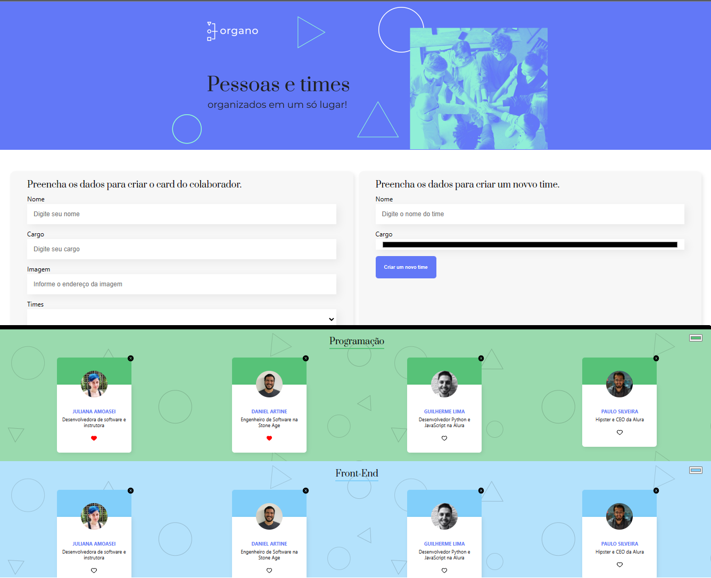

<h1 align="center"> Organo 2</h1>

  <a href="#-tecnologias">Tecnologias</a>&nbsp;&nbsp;&nbsp;|&nbsp;&nbsp;&nbsp;
  <a href="#-projeto">Projeto</a>&nbsp;&nbsp;&nbsp;|&nbsp;&nbsp;&nbsp;
  <a href="#-layout">Layout</a>&nbsp;&nbsp;&nbsp;|&nbsp;&nbsp;&nbsp;

 

  

## 🚀 Tecnologias

Esse projeto foi desenvolvido com as seguintes tecnologias:

- HTML
- CSS
- JavaScript
- React

## 💻 Projeto

Organo 2 é um projeto que tem a funcionalidade de adicionar cards com nome, cargo, imagem em times de tecnologia.
Também é possível inserir um novo time e a cor do time.
Favoritar o card também é uma funcionalidade nova nesse projeto.

## 🔖 Layout

Projeto desenvolvido pela e Alura.